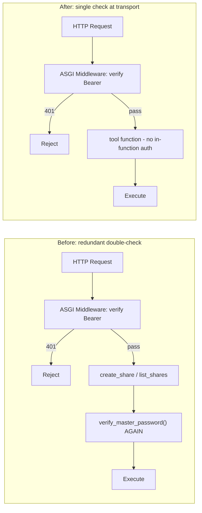

# Plan: Remove Redundant `master_password` Parameter from MCP Tools

> **Status**: 📋 Planned — ready for implementation
> **Created**: 2026-07-02T07:02:00Z
> **Target**: Remove `master_password` parameter from `create_share` and `list_shares` MCP tools — auth happens ONLY via Bearer token at the HTTP transport layer

---

## 1. Problem Statement

The ASGI Bearer-auth middleware at [`backend/mcp_server.py:257`](backend/mcp_server.py:257) already enforces `Authorization: Bearer <MDSHARE_MASTER_PASSWORD>` for **all** `/api/mcp` traffic. However, two MCP tools still carry a redundant `master_password` parameter and call `verify_master_password()` internally:

| Tool | Line | Redundant Auth |
|------|------|----------------|
| `create_share` | [52–62](backend/mcp_server.py:52) | ✅ `master_password` param + `verify_master_password()` |
| `list_shares` | [191–194](backend/mcp_server.py:191) | ✅ `master_password` param + `verify_master_password()` |

This was originally kept as "defense in depth" ([mcp-bearer-auth.md:205](plans/mcp-bearer-auth.md:205)), but is now dead code: the middleware rejects all unauthenticated requests with 401 before any tool function runs.

---

## 2. Flow: Before vs. After



---

## 3. Changes: [`backend/mcp_server.py`](backend/mcp_server.py)

### 3.1 `create_share` (lines 52–62)

**Remove** `master_password: str` from signature and the `verify_master_password()` guard.

**Before:**
```python
@mcp.tool()
async def create_share(
    content: str,
    master_password: str,
    protected: bool = False,
    images: list[str] | None = None,
    ttl_hours: int | None = None,
) -> dict[str, Any]:
    """Create new share from tool arguments."""
    if not verify_master_password(master_password):
        return {"error": "Invalid master password"}
```

**After:**
```python
@mcp.tool()
async def create_share(
    content: str,
    protected: bool = False,
    images: list[str] | None = None,
    ttl_hours: int | None = None,
) -> dict[str, Any]:
    """Create new share from tool arguments. Auth via Bearer token."""
```

### 3.2 `list_shares` (lines 190–194)

**Remove** `master_password: str` from signature and the `verify_master_password()` guard.

**Before:**
```python
@mcp.tool()
async def list_shares(master_password: str) -> dict[str, Any]:
    """List all active shares."""
    if not verify_master_password(master_password):
        return {"error": "Invalid master password"}
```

**After:**
```python
@mcp.tool()
async def list_shares() -> dict[str, Any]:
    """List all active shares. Auth via Bearer token."""
```

### 3.3 Unused import (line 17)

`verify_master_password` is only imported by these two tools. After removal, it becomes unused:

```diff
-from backend.services.auth import extract_bearer_token, verify_master_password
+from backend.services.auth import extract_bearer_token
```

(`extract_bearer_token` is still used by the middleware at line 244.)

---

## 4. Changes: [`backend/__tests__/test_mcp_server.py`](backend/__tests__/test_mcp_server.py)

### 4.1 Delete 4 tests that validate the `master_password` parameter

These tests are meaningless once the parameter is removed — the ASGI middleware enforces auth at a higher level:

| Test Class | Test Method | Lines |
|---|---|---|
| `TestCreateShare` | `test_missing_master_password_returns_error` | 30–39 |
| `TestCreateShare` | `test_wrong_master_password_returns_error` | 41–50 |
| `TestListShares` | `test_missing_master_password_returns_error` | 349–354 |
| `TestListShares` | `test_wrong_master_password_returns_error` | 356–361 |

### 4.2 Strip `master_password=` from 14 `create_share()` calls

Every remaining call to `create_share()` currently passes `master_password=_VALID_PW` (or `master_password=""`). Remove the argument from all callsites:

| Test Method | Lines Where Argument Appears |
|---|---|
| `test_public_share_returns_url_and_id` | 57 |
| `test_protected_share_returns_password` | 70 |
| `test_empty_content_returns_error` | 84 |
| `test_whitespace_only_content_returns_error` | 95 |
| `test_content_exceeds_max_size` | 106 |
| `test_images_parameter_accepted` | 117 |
| `test_invalid_base64_image_returns_error` | 130 |
| `test_image_data_too_large` | 143 |
| `test_default_ttl_returns_valid_until` | 156 |
| `test_custom_ttl_hours` | 170 |
| `test_ttl_zero_returns_no_expiry` | ~193 |
| `test_list_shares_excludes_expired_shares` (in `TestListShares`) | ~387, ~405 |
| `test_list_shares_returns_correct_schema` (in `TestListShares`) | ~426 |

### 4.3 Strip `master_password=` from 5 `list_shares()` calls

| Test Method | Lines Where Argument Appears |
|---|---|
| `test_returns_empty_list_when_no_shares` | 345 |
| `test_list_shares_returns_multiple_shares` | 375 |
| `test_list_shares_excludes_expired_shares` | 390, 416 |
| `test_list_shares_returns_correct_schema` | 428 |

Each changes from `list_shares(master_password=_VALID_PW)` to `list_shares()`.

### 4.4 Remove `_VALID_PW` constant (line 24)

`_VALID_PW` becomes unused after all `master_password=` references are removed:

```diff
-# conftest.py sets MDSHARE_MASTER_PASSWORD="test-master-password"
-_VALID_PW = "test-master-password"
```

(`TestMcpBearerAuth` uses its own `_VALID_TOKEN` constant at line 443, so this is not shared.)

---

## 5. Changes: [`plans/mcp-bearer-auth.md`](plans/mcp-bearer-auth.md)

Update the summary table to reflect that tool-level auth is removed:

**Line 205 — Row "Tool-level auth":**

```diff
-| Tool-level auth | ✅ `master_password` param | ✅ unchanged (defense in depth) |
+| Tool-level auth | ✅ `master_password` param | ❌ Removed — redundant with middleware |
```

---

## 6. Risk Assessment

| Concern | Verdict |
|---------|---------|
| Does removing `master_password` weaken security? | **No** — the ASGI middleware at line 257 already rejects all unauthenticated requests with 401 before any tool runs |
| Could a tool be called without auth somehow? | **No** — the middleware wraps the entire `mcp.streamable_http_app()`, covering all MCP endpoints |
| Do tests still cover auth? | **Yes** — `TestMcpBearerAuth` class (lines 435+) directly tests the ASGI middleware with proper/empty/wrong/invalid tokens |
| Are there non-MCP callers of these functions? | **No** — only FastMCP's HTTP dispatch calls them; Flask has its own routes in `app.py` |

---

## 7. Files Modified

| File | Changes |
|------|---------|
| [`backend/mcp_server.py`](backend/mcp_server.py) | 3 edits: `create_share` sig, `list_shares` sig, import cleanup |
| [`backend/__tests__/test_mcp_server.py`](backend/__tests__/test_mcp_server.py) | Delete 4 tests, strip arg from ~19 callsites, remove `_VALID_PW` |
| [`plans/mcp-bearer-auth.md`](plans/mcp-bearer-auth.md) | Update summary table |

---

## 8. Implementation Order

1. **Edit `mcp_server.py`** — remove params from both tools + clean up imports
2. **Edit `test_mcp_server.py`** — strip `master_password=` from all calls, delete 4 auth tests, remove `_VALID_PW`
3. **Run `make test`** — verify all tests pass
4. **Update `mcp-bearer-auth.md`** — update summary table
5. **Git commit**
