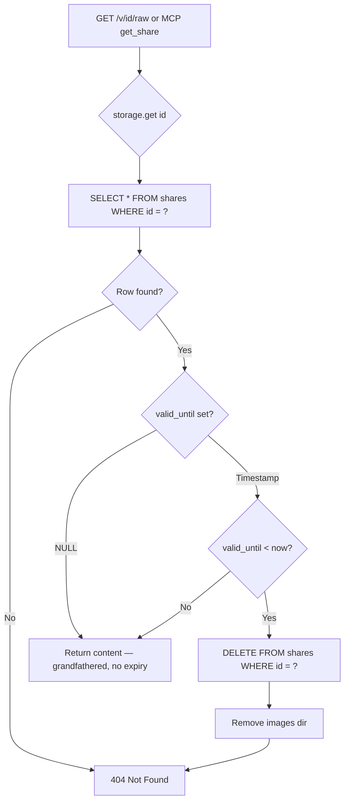

# Plan: Retention Time for Shares

> **Status**: 📐 Draft — awaiting review
> **Created**: 2026-06-30T16:28:00Z
> **Target**: Introduce automatic expiry of shares with a default 1-week retention, lazy-deleted on access.

---

## 1. Goals

- Every share has a `valid_until` timestamp stored alongside it
- Default retention: **168 hours (7 days)** from creation
- Uploader can override the TTL via a `ttl` parameter (hours)
- When a share is retrieved and its `valid_until` is in the past, it is **automatically deleted** (row + images) and a **404** is returned — no separate cron job
- **No delete endpoint** — deletion happens exclusively through this lazy expiry mechanism
- Primary implementation in the Flask API; MCP server inherits the behaviour via the shared storage layer

---

## 2. Lazy Expiry Pattern



**Rationale**: A single `get()` call is the choke point through which every view, raw-fetch, and MCP retrieval passes. Putting the expiry check there means every access path gets it for free — no duplicate logic, no missed code paths.

---

## 3. Database Schema Change

### 3.1 New Column

```sql
ALTER TABLE shares ADD COLUMN valid_until TEXT;
```

Column details:
| Attribute | Value |
|-----------|-------|
| **Type** | `TEXT` (ISO 8601 UTC, e.g. `2026-07-07T16:28:00Z`) |
| **Nullable** | Yes — `NULL` means _"grandfathered, never expires"_ |
| **Default (new rows)** | `datetime.now(UTC) + 168 hours` — computed at insert time, not a SQL-level default |

### 3.2 Migration Strategy

SQLite's `ALTER TABLE ADD COLUMN` raises `OperationalError` if the column already exists. The migration code in [`sqlite.py`](backend/storage/sqlite.py) uses a try/except pattern:

```python
def _migrate_schema(self) -> None:
    """Add valid_until column if it does not exist (idempotent)."""
    try:
        self._conn.execute("ALTER TABLE shares ADD COLUMN valid_until TEXT")
        self._conn.commit()
    except sqlite3.OperationalError:
        pass  # column already exists
```

Called from `_init_schema()` after the `CREATE TABLE IF NOT EXISTS`.

### 3.3 Updated CREATE TABLE

The `CREATE TABLE IF NOT EXISTS` statement is updated to include the new column for fresh installations:

```sql
CREATE TABLE IF NOT EXISTS shares (
    id         TEXT PRIMARY KEY,
    content    TEXT NOT NULL,
    password   TEXT,
    created_at TEXT NOT NULL DEFAULT (datetime('now')),
    valid_until TEXT
);
```

---

## 4. Storage Layer Changes

### 4.1 [`StorageBackend` ABC](backend/storage/abstract.py)

**`create()` — extended `doc` dict**:

The `doc` dict passed to `create()` gains an optional key:

| Key | Type | Description |
|-----|------|-------------|
| `content` | `str` | Markdown content (unchanged) |
| `password` | `str \| None` | Bcrypt hash (unchanged) |
| `valid_until` | `str \| None` | **New** — ISO 8601 UTC timestamp, or `None` for no expiry |

The ABC docstring is updated to document the new key.

**`get()` — implicit expiry**:

The docstring is updated to note that an expired share is silently deleted and `None` is returned (indistinguishable from "not found" — 404 in both cases).

**New internal method `delete()`**:

A `delete(doc_id: str) -> None` method is added to the ABC. It is **not** exposed via HTTP or MCP; it exists solely so the storage backend can clean up expired rows from within `get()`.

### 4.2 [`SqliteStorage`](backend/storage/sqlite.py)

**`_init_schema()`** — calls `_migrate_schema()` after ensuring the table exists.

**`create()`** — stores the `valid_until` value in the new column:

```sql
INSERT INTO shares (id, content, password, valid_until)
VALUES (?, ?, ?, ?)
```

**`get()`** — after fetching the row:
```python
def get(self, doc_id: str) -> dict | None:
    row = ...
    if row is None:
        return None
    valid_until = row["valid_until"]
    if valid_until is not None:
        expiry = datetime.fromisoformat(valid_until)
        if expiry <= datetime.now(timezone.utc):
            self.delete(doc_id)
            return None
    return dict(row)
```

**`delete()`** — new method:
```python
def delete(self, doc_id: str) -> None:
    """Delete a share row and its image directory (internal use only)."""
    self._conn.execute("DELETE FROM shares WHERE id = ?", (doc_id,))
    self._conn.commit()
    img_dir = os.path.join(DATA_DIR, "images", doc_id)
    if os.path.isdir(img_dir):
        shutil.rmtree(img_dir)
```

**Imports** — `shutil`, `datetime`, `timezone` are added.

### 4.3 `exists()` — Unchanged

The `exists()` method does **not** trigger lazy deletion. Rationale: `exists()` is used by the viewer-page route (`GET /v/<id>`) and the health check. For the viewer page, a 404 from `exists` is fine — the viewer JS will show an error. For health checks (dummy ID), it's a no-op. No need to add expiry logic to `exists()`.

However, this means the viewer page at `GET /v/<id>` will show a 404 for expired shares, which is the correct behaviour.

---

## 5. Flask API Changes ([`app.py`](backend/app.py))

### 5.1 `PUT /api/share` — New Form Field

| Field | Type | Required | Default | Description |
|-------|------|----------|---------|-------------|
| `ttl` | `int` (string) | No | `168` | Time-to-live in **hours**. Must be ≥ 1. |

**Validation**:
- If `ttl` is not provided → default `168`
- If `ttl` is provided but not a valid positive integer → 400 error
- `ttl` values exceeding some reasonable maximum (e.g. 8760 = 1 year) are accepted — no upper bound enforced

**Computation**:
```python
from datetime import datetime, timedelta, timezone

ttl_str = request.form.get("ttl", "168")
try:
    ttl_hours = int(ttl_str)
    if ttl_hours < 1:
        raise ValueError
except (ValueError, TypeError):
    return jsonify({"error": "ttl must be a positive integer"}), 400

valid_until = (datetime.now(timezone.utc) + timedelta(hours=ttl_hours)).isoformat()
```

**Passed to storage**:
```python
storage.create(
    doc_id,
    {"content": content, "password": password_hash, "valid_until": valid_until},
)
```

### 5.2 View Routes — No Changes Needed

| Route | Behaviour |
|-------|-----------|
| `GET /v/<id>` | Calls `storage.exists()` → returns 404 for expired (correct) |
| `GET /v/<id>/raw` | Calls `storage.get()` → expired share triggers lazy delete, returns 404 |
| `GET /v/<id>/img/<filename>` | Expired share's images already deleted by `storage.delete()` → 404 |

### 5.3 Response Changes

The upload response gains a `valid_until` field so the uploader knows when the share expires:

```json
{
    "url": "https://host/v/<id>",
    "password": "aB3dEfGh",          // only when protected
    "valid_until": "2026-07-07T16:28:00Z"
}
```

---

## 6. MCP Server Changes ([`mcp_server.py`](backend/mcp_server.py))

### 6.1 `create_share` — New Parameter

```python
async def create_share(
    content: str,
    protected: bool = False,
    images: dict[str, str] | None = None,
    ttl_hours: int = 168,          # NEW
) -> dict[str, Any]:
```

**Validation**: Same as API — must be positive integer.

**Response**: Gains `valid_until` field alongside `id`, `url`, and optional `password`.

### 6.2 `get_share` and `get_share_info` — No Changes Needed

Both call `storage.get()` which now handles lazy expiry automatically.

### 6.3 Import Changes

`datetime`, `timedelta`, `timezone` are already imported via `from backend.app import ...`. The `valid_until` computation uses the same pattern as `app.py` (or a shared helper — see §8).

---

## 7. Test Changes

### 7.1 New Test: Expiry Behaviour

**File**: New test class in [`test_view.py`](backend/__tests__/test_view.py) or a new `test_retention.py`

| Test | Description |
|------|-------------|
| `test_expired_share_returns_404_and_deletes_row` | Create share with `valid_until` in the past, call `storage.get()`, verify `None`, verify row deleted from DB |
| `test_expired_share_deletes_image_files` | Create share with `valid_until` in the past + image, call `storage.get()`, verify image directory gone |
| `test_non_expired_share_still_accessible` | Create share with `valid_until` in the future, call `storage.get()`, verify content returned |
| `test_null_valid_until_is_grandfathered` | Create share with `valid_until=None`, call `storage.get()`, verify content returned (never expires) |
| `test_expired_share_via_raw_endpoint_returns_404` | Create expired share, GET `/v/<id>/raw`, verify 404 |
| `test_expired_share_via_viewer_page_returns_404` | Create expired share, GET `/v/<id>`, verify 404 |

### 7.2 Updated Tests: Upload with TTL

**File**: [`test_upload.py`](backend/__tests__/test_upload.py)

| Test | Description |
|------|-------------|
| `test_upload_with_custom_ttl` | PUT with `ttl=24`, verify `valid_until` in response is ~24h from now |
| `test_upload_default_ttl` | PUT without `ttl`, verify `valid_until` in response is ~168h from now |
| `test_upload_invalid_ttl_returns_400` | PUT with `ttl=abc` / `ttl=-1` / `ttl=0`, verify 400 |
| `test_response_includes_valid_until` | Verify upload response JSON contains `valid_until` field |

### 7.3 Updated Tests: MCP Server

**File**: [`test_mcp_server.py`](backend/__tests__/test_mcp_server.py)

| Test | Description |
|------|-------------|
| `test_create_share_default_ttl` | Call `create_share(content="# T", ttl_hours=None)`, verify `valid_until` in result |
| `test_create_share_custom_ttl` | Call `create_share(content="# T", ttl_hours=1)`, verify `valid_until` ~1h from now |
| `test_create_share_invalid_ttl` | Call with `ttl_hours=-1`, verify error response |

### 7.4 Fixture Update

**File**: [`fixtures.py`](backend/__tests__/helpers/fixtures.py)

`make_document()` gains an optional `valid_until` parameter:

```python
def make_document(
    *,
    doc_id: str = "test123456789",
    content: str = "# Test Document",
    password: str | None = None,
    valid_until: str | None = None,   # NEW
) -> dict:
```

### 7.5 Storage Reset Update

**File**: [`conftest.py`](backend/__tests__/conftest.py)

The `reset_storage` fixture also needs to clean up test image directories between tests:

```python
@pytest.fixture(autouse=True)
def reset_storage():
    storage = get_storage()
    conn = storage._conn
    conn.execute("DELETE FROM shares")
    conn.commit()
    # Clean up test image directories
    img_root = os.path.join(_test_data_dir, "images")
    if os.path.isdir(img_root):
        shutil.rmtree(img_root)
    yield
    conn.execute("DELETE FROM shares")
    conn.commit()
    if os.path.isdir(img_root):
        shutil.rmtree(img_root)
```

---

## 8. Optional: DRY — Shared TTL Helper

Both [`app.py`](backend/app.py) and [`mcp_server.py`](backend/mcp_server.py) need identical TTL computation logic. To avoid duplication:

**Option A** (recommended): Extract a helper function and re-export from `app.py`:

```python
# In app.py (imported by mcp_server.py)
def compute_valid_until(ttl_hours: int) -> str:
    """Return ISO 8601 UTC timestamp ttl_hours from now."""
    return (datetime.now(timezone.utc) + timedelta(hours=ttl_hours)).isoformat()
```

**Option B**: Keep the computation inline in each file (only ~3 lines each). Simpler but duplicates the import chain.

**Decision**: Option A — since `mcp_server.py` already imports from `backend.app`, adding one more import is trivial.

---

## 9. Summary of File Changes

| File | Change | Impact |
|------|--------|--------|
| [`storage/abstract.py`](backend/storage/abstract.py) | Add `delete()` to ABC; update `create`/`get` docstrings | Interface change |
| [`storage/sqlite.py`](backend/storage/sqlite.py) | Schema migration, `delete()`, lazy expiry in `get()`, updated `create()` | Core logic |
| [`app.py`](backend/app.py) | `ttl` form field, `valid_until` computation, response field, `compute_valid_until()` helper | API change |
| [`mcp_server.py`](backend/mcp_server.py) | `ttl_hours` parameter, `valid_until` in response | MCP change |
| [`__tests__/test_upload.py`](backend/__tests__/test_upload.py) | TTL-related test cases | Tests |
| [`__tests__/test_view.py`](backend/__tests__/test_view.py) | Expiry behaviour test cases | Tests |
| [`__tests__/test_mcp_server.py`](backend/__tests__/test_mcp_server.py) | TTL parameter test cases | Tests |
| [`__tests__/helpers/fixtures.py`](backend/__tests__/helpers/fixtures.py) | `valid_until` parameter on `make_document()` | Tests |
| [`__tests__/conftest.py`](backend/__tests__/conftest.py) | Image directory cleanup in `reset_storage` | Tests |
| [`README.md`](README.md) | Document `ttl` field in API reference | Docs |

---

## 10. Design Decisions Log

| # | Question | Decision | Rationale |
|---|----------|----------|-----------|
| 1 | Where does expiry check live? | In `storage.get()` | Single choke point — all API + MCP paths hit it |
| 2 | `exists()` expiry behaviour? | No expiry check | Viewer page gets correct 404; health check unaffected |
| 3 | NULL `valid_until` meaning? | Grandfathered — never expires | Safe for existing rows; optional escape hatch |
| 4 | TTL unit? | Hours (integer) | Simple, precise, familiar |
| 5 | TTL default? | 168 (7 days) | Explicit user requirement |
| 6 | TTL upper bound? | None | User can set 8760 (1 year) or more |
| 7 | `delete()` on ABC? | Yes, but internal-only | Needed for lazy expiry; not exposed via HTTP/MCP |
| 8 | Image cleanup timing? | At expiry-delete time | Synchronous, no dangling files |
| 9 | Shared TTL helper? | Yes (`compute_valid_until` in `app.py`) | DRY — both `app.py` and `mcp_server.py` need it |
| 10 | `valid_until` in upload response? | Yes | Transparent — uploader knows expiry upfront |
