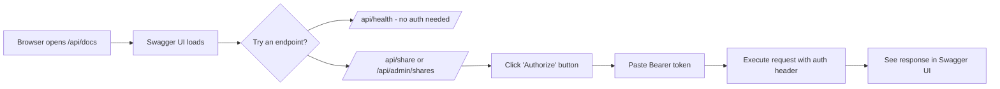

# Swagger / OpenAPI Endpoint for mdshare

## Summary

Add auto-generated Swagger UI at `/api/docs` via [Flasgger](https://github.com/flasgger/flasgger), making the mdshare API browsable and interactive for humans.

## Approach: Flasgger

**Why Flasgger over alternatives:**

| Option | Pros | Cons |
|---|---|---|
| **Flasgger** ✅ | Works with plain `@app.route()`, parses YAML from docstrings, serves Swagger UI built-in, single dependency | Some magic in docstring parsing |
| flask-swagger-ui | Ultra-minimal, explicit | Must manually maintain a separate `openapi.yaml` |
| flask-restx | Auto-validation, model classes | Requires refactoring routes to Resource/Namespace classes |
| apispec + marshmallow | Most flexible | Heaviest, 3+ new dependencies |

Flasgger is the best fit for mdshare's "minimal" ethos — one dependency, leverages existing docstrings, no route refactoring.

## Security

- **Swagger UI page** (`/api/docs/`) — **public**, no auth required
- **"Try it out" feature** — user enters Bearer token via Swagger UI's built-in "Authorize" button
- **API endpoints** — auth enforced at route level (unchanged), Swagger UI sends the token as `Authorization: Bearer <token>` header

## Changes

### 1. `backend/requirements.txt` — add dependency

```diff
 flask>=3.0
 uvicorn>=0.30.0
 bcrypt>=4.0
 python-multipart>=0.0.12
 mcp>=1.0.0
 asgiref>=3.0
+flasgger>=0.9.5
```

### 2. `backend/app.py` — initialize Flasgger

Add after the `app = Flask(...)` line and `ProxyFix` setup:

```python
from flasgger import Swagger

swagger_config = {
    "headers": [],
    "specs": [{"endpoint": "apispec", "route": "/apispec.json"}],
    "static_url_path": "/flasgger_static",
    "swagger_ui": True,
    "specs_route": "/api/docs/",
}

swagger_template = {
    "swagger": "2.0",
    "info": {
        "title": "mdshare API",
        "description": "Minimal, self-hosted Markdown sharing service.",
        "version": "1.0.0",
    },
    "securityDefinitions": {
        "Bearer": {
            "type": "apiKey",
            "name": "Authorization",
            "in": "header",
            "description": "Master password as Bearer token. Format: `Bearer <your-master-password>`",
        }
    },
}

Swagger(app, config=swagger_config, template=swagger_template)
```

### 3. `backend/app.py` — add OpenAPI YAML to each route docstring

Each route gets a YAML block delimited by `---` inside its docstring:

#### `GET /api/health`

```yaml
tags: [Health]
responses:
  200:
    description: Service is healthy
    schema:
      type: object
      properties:
        status: {type: string, example: ok}
```

#### `PUT /api/share`

```yaml
tags: [Share]
security:
  - Bearer: []
consumes:
  - multipart/form-data
parameters:
  - {name: content, in: formData, type: string, required: true, description: Raw Markdown text}
  - {name: protected, in: formData, type: string, enum: [yes, no], default: no, description: Password-protect the share}
  - {name: ttl, in: formData, type: integer, default: 168, description: Time-to-live in hours}
  - {name: file, in: formData, type: file, description: Image files referenced in the Markdown}
responses:
  201:
    description: Share created
    schema:
      type: object
      properties:
        url: {type: string, example: https://example.com/v/abc123}
        password: {type: string}
        valid_until: {type: string, format: date-time}
  400: {description: Missing content or invalid TTL}
  401: {description: Invalid or missing master password}
  413: {description: Content exceeds size limit}
```

#### `GET /api/admin/shares`

```yaml
tags: [Admin]
security:
  - Bearer: []
responses:
  200:
    description: List of active shares
    schema:
      type: object
      properties:
        shares:
          type: array
          items:
            type: object
            properties:
              id: {type: string}
              url: {type: string}
              created_at: {type: string}
              valid_until: {type: string}
              protected: {type: boolean}
        count: {type: integer}
  401: {description: Missing or invalid master password}
```

#### `GET /v/<doc_id>/raw`

```yaml
tags: [View]
parameters:
  - {name: doc_id, in: path, type: string, required: true, description: Share ID}
  - {name: pw, in: query, type: string, required: false, description: Password for protected shares}
responses:
  200:
    description: Raw Markdown content
    schema: {type: string}
  403: {description: Incorrect password}
  404: {description: Share not found}
```

### 4. `README.md` — document the new endpoint

Add to the API reference table:

```
| `GET` | `/api/docs` | None | Swagger UI (interactive API docs) |
```

### 5. `docs/TASK_LOG.md` — log the change

Standard task log entry.

## What does NOT change

| Artifact | Reason |
|---|---|
| `Dockerfile` | flasgger is pure Python, pip-installable, no system deps |
| `docker-compose.yml` | No new env vars or ports needed |
| `backend/asgi.py` | Swagger routes are part of the Flask app, routed automatically |
| `backend/config.py` | No new configuration needed |
| `backend/services/*` | No business logic changes |
| Test files | Flasgger is additive; existing tests pass unchanged |

## Visual: Swagger UI flow



## Open Questions

1. **Should the Swagger spec JSON also be accessible at `/apispec.json`?** — Flasgger serves this by default; useful for importing into tools like Postman. Recommend keeping it.
2. **Should non-API routes (`/v/<doc_id>`, `/themes.css`) be excluded from the spec?** — They serve HTML/CSS, not JSON. Flasgger's `rule_filter` can exclude them. Recommend excluding them for cleaner docs.
