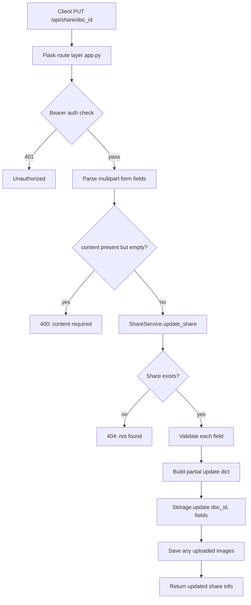

# Update Share Endpoint

## Summary

Add a `PUT /api/share/<doc_id>` endpoint that allows updating an existing share's fields. Only transported fields are updated; empty optional fields clear the database value. Mandatory fields (content) reject empty values with a 400 error.

Also add `id` to the `PUT /api/share` (create) response. The `GET /api/admin/shares` endpoint already returns `id` — no changes needed there.

---

## Current State Analysis

### PUT /api/share (create) — `id` missing from response

**File**: [`backend/app.py`](backend/app.py:321-329)

```python
return (
    jsonify({
        "url": f"{_base_url()}/v/{doc_id}",
        "password": view_password,
        "valid_until": result.get("valid_until"),
    }),
    201,
)
```

The `id` is already computed and available as `doc_id` (line 312) and `result["id"]` — simply not included in the response JSON.

### GET /api/admin/shares — already returns `id`

Confirmed in:
- [`backend/storage/sqlite.py`](backend/storage/sqlite.py:221-227) — `list_active` returns `id` in each dict
- [`backend/app.py`](backend/app.py:392-398) — Swagger docstring includes `id` in schema
- [`backend/app.py`](backend/app.py:425-426) — URL is built from `share['id']`

**No changes needed.**

### Storage layer — no `update` method

The [`StorageBackend`](backend/storage/abstract.py) ABC has `create`, `get`, `exists`, `delete`, `update_valid_until`, and `list_active`. There is no general-purpose `update` method.

### Service layer — no `update_share` method

[`ShareService`](backend/services/share_service.py) has `create_share`, `get_share`, `list_shares`, `set_valid_until_date`, etc. No update method exists.

---

## Architecture

### Data Flow



### Field Update Semantics

| Field | Transported? | Value | Action |
|-------|-------------|-------|--------|
| `content` | No | — | Leave unchanged |
| `content` | Yes | Non-empty | Update content, rewrite image URLs |
| `content` | Yes | Empty (whitespace) | **400 error** — mandatory field |
| `protected` | No | — | Leave unchanged |
| `protected` | Yes | `"yes"` / `"true"` / `"1"` | Generate new bcrypt password, store hash |
| `protected` | Yes | `"no"` / other | Clear password (make public) |
| `protected` | Yes | Empty string | Clear password (make public) |
| `ttl` | No | — | Leave `valid_until` unchanged |
| `ttl` | Yes | Positive integer | Recompute `valid_until` = now + ttl hours |
| `ttl` | Yes | `0` | Clear `valid_until` (set NULL = never expire) |
| `ttl` | Yes | Negative / invalid | **400 error** |
| `display_config` | No | — | Leave unchanged |
| `display_config` | Yes | Valid JSON string | Validate keys, update |
| `display_config` | Yes | Empty string | Clear `display_config` (set NULL) |
| `display_config` | Yes | Invalid JSON | **400 error** |
| Image files | No | — | Leave existing images unchanged |
| Image files | Yes | File parts present | Save/overwrite images for this share |

### Key Design Decision: `valid_until` is derived, not direct

The create endpoint uses `ttl` (hours from now) rather than an absolute date. For consistency, the update endpoint also uses `ttl` as the input and recomputes `valid_until` from "now" rather than accepting a raw ISO 8601 date. If the user needs to set an absolute date, the existing `POST /api/admin/shares/validuntil` endpoint already handles that.

---

## Implementation Steps

### Step 1 — Storage layer: add `update` method

**File**: [`backend/storage/abstract.py`](backend/storage/abstract.py)

Add abstract method to `StorageBackend`:

```python
@abstractmethod
def update(self, doc_id: str, fields: dict) -> bool:
    """Update specific fields of an existing share.

    Args:
        doc_id: Share identifier.
        fields: Dict with any subset of keys:
                - 'content' (str): Updated markdown text.
                - 'password' (str | None): bcrypt hash or None.
                - 'valid_until' (str | None): ISO 8601 or None.
                - 'display_config' (dict | None): Display overrides or None.

    Returns:
        True if the row existed and was updated, False if not found.
    """
    ...
```

**File**: [`backend/storage/sqlite.py`](backend/storage/sqlite.py)

Implement `update`:

```python
def update(self, doc_id: str, fields: dict) -> bool:
    """Update specific fields of an existing share."""
    # Build SET clause dynamically from provided fields
    set_clauses = []
    params = []
    for key in ("content", "password", "valid_until", "display_config"):
        if key in fields:
            set_clauses.append(f"{key} = ?")
            if key == "display_config":
                params.append(self._serialize_display_config(fields[key]))
            else:
                params.append(fields[key])
    
    if not set_clauses:
        return self.exists(doc_id)  # nothing to update
    
    params.append(doc_id)
    sql = f"UPDATE shares SET {', '.join(set_clauses)} WHERE id = ?"
    cursor = self._conn.execute(sql, params)
    self._conn.commit()
    return cursor.rowcount > 0
```

### Step 2 — Service layer: add `update_share` method

**File**: [`backend/services/share_service.py`](backend/services/share_service.py)

Add `update_share` method to `ShareService`:

```python
def update_share(
    self,
    doc_id: str,
    content: str | None = None,
    protected: bool | None = None,
    ttl_hours: int | None = None,
    filenames: set[str] | None = None,
    display_config: dict | None = None,
) -> dict:
    """Update an existing share. Only provided fields are modified.

    Args:
        doc_id: Share identifier.
        content: New markdown text (if provided, must be non-empty).
        protected: Change password protection state.
        ttl_hours: New TTL in hours (0 = never expire).
        filenames: Image filenames for URL rewriting.
        display_config: New display config dict, or None to clear.

    Returns:
        Dict with updated share info: id, url path, password, valid_until.

    Raises:
        ValueError: If content is empty, ttl is invalid, or display_config
                    contains unknown keys.
    """
    # Validate share exists
    if not self.storage.exists(doc_id):
        raise ValueError("share not found")

    fields: dict = {}

    # --- content ---
    if content is not None:
        content = content.strip()
        if not content:
            raise ValueError("Content cannot be empty")
        if filenames:
            content = rewrite_image_urls(content, doc_id, filenames)
        fields["content"] = content

    # --- protected ---
    if protected is not None:
        if protected:
            password = secrets.token_urlsafe(9)
            password_hash = bcrypt.hashpw(
                password.encode(), bcrypt.gensalt()
            ).decode()
            fields["password"] = password_hash
        else:
            fields["password"] = None

    # --- ttl ---
    if ttl_hours is not None:
        if ttl_hours < 0:
            raise ValueError(
                "invalid ttl — must be a non-negative integer"
            )
        if ttl_hours == 0:
            fields["valid_until"] = None
        else:
            fields["valid_until"] = (
                datetime.now(timezone.utc) + timedelta(hours=ttl_hours)
            ).isoformat()

    # --- display_config ---
    if display_config is not None:
        # Reuse existing validation logic from create_share
        if not isinstance(display_config, dict):
            raise ValueError(
                "invalid display_config: must be a dict"
            )
        # Validate keys/values (same as create_share)
        allowed_keys = display_config_module.get_allowed_keys()
        for k, v in display_config.items():
            if k not in allowed_keys:
                raise ValueError(
                    f"invalid display_config: unknown key '{k}'"
                )
            # type validation...
        fields["display_config"] = display_config

    # --- persist ---
    self.storage.update(doc_id, fields)

    # Re-read to get current state
    doc = self.storage.get(doc_id)
    return {
        "id": doc_id,
        "password": password if (protected and protected is not None) else None,
        "valid_until": doc.get("valid_until") if doc else None,
    }
```

### Step 3 — API layer: add `PUT /api/share/<doc_id>` route

**File**: [`backend/app.py`](backend/app.py)

Add new route after the existing `PUT /api/share` route (after line 330):

```python
@app.route("/api/share/<doc_id>", methods=["PUT"])
def update_share(doc_id: str):
    """Update an existing share.
    ---
    tags: [Share]
    security:
      - Bearer: []
    consumes:
      - multipart/form-data
    parameters:
      - {name: doc_id, in: path, type: string, required: true, description: Share ID}
      - {name: content, in: formData, type: string, required: false, description: Updated Markdown text}
      - {name: protected, in: formData, type: string, enum: [yes, no], required: false, description: Change password protection}
      - {name: ttl, in: formData, type: integer, required: false, description: New TTL in hours}
      - {name: display_config, in: formData, type: string, required: false, description: Updated display config JSON}
      - {name: file, in: formData, type: file, required: false, description: Image files}
    responses:
      200:
        description: Share updated
        schema:
          type: object
          properties:
            id: {type: string}
            url: {type: string}
            password: {type: string}
            valid_until: {type: string, format: date-time}
      400: {description: Validation error}
      401: {description: Invalid or missing master password}
      404: {description: Share not found}
    """
    if not _check_master_auth():
        return jsonify({"error": "unauthorized"}), 401

    # Check share exists
    if not share_service.exists(doc_id):
        return jsonify({"error": "not found"}), 404

    # Parse optional fields — only include those actually sent
    kwargs: dict = {}

    raw_content = request.form.get("content")
    if raw_content is not None:
        kwargs["content"] = raw_content

    raw_protected = request.form.get("protected")
    if raw_protected is not None:
        kwargs["protected"] = raw_protected.lower() in ("yes", "true", "1")

    raw_ttl = request.form.get("ttl")
    if raw_ttl is not None and raw_ttl.strip():
        try:
            kwargs["ttl_hours"] = int(raw_ttl)
        except (ValueError, TypeError):
            return jsonify({"error": "invalid ttl — must be an integer"}), 400
    elif raw_ttl is not None:
        # Empty ttl string → interpreted as "no expiry change"
        pass

    raw_display = request.form.get("display_config")
    if raw_display is not None and raw_display.strip():
        try:
            kwargs["display_config"] = json.loads(raw_display)
        except json.JSONDecodeError:
            return jsonify({"error": "invalid display_config — must be valid JSON"}), 400
    elif raw_display is not None:
        # Empty display_config → clear it
        kwargs["display_config"] = None

    # Collect uploaded filenames
    filenames: set[str] = set()
    for key in request.files:
        file = request.files[key]
        if file and file.filename:
            filenames.add(file.filename)
    if filenames:
        kwargs["filenames"] = filenames

    # If nothing was sent at all
    if not kwargs:
        return jsonify({"error": "no fields to update"}), 400

    try:
        result = share_service.update_share(doc_id, **kwargs)
    except ValueError as err:
        return jsonify({"error": str(err)}), 400

    # Save uploaded images
    for key in request.files:
        file = request.files[key]
        if file and file.filename:
            save_uploaded_image(file, doc_id, file.filename)

    doc = share_service.get_share(doc_id)
    if doc is None or isinstance(doc, dict) and "error" in doc:
        return jsonify({"error": "not found"}), 404

    return jsonify({
        "id": doc_id,
        "url": f"{_base_url()}/v/{doc_id}",
        "password": doc.get("password"),
        "valid_until": doc.get("valid_until"),
    })
```

### Step 4 — Add `id` to create response

**File**: [`backend/app.py`](backend/app.py:321-329)

Change:

```python
return (
    jsonify({
        "url": f"{_base_url()}/v/{doc_id}",
        "password": view_password,
        "valid_until": result.get("valid_until"),
    }),
    201,
)
```

To:

```python
return (
    jsonify({
        "id": doc_id,
        "url": f"{_base_url()}/v/{doc_id}",
        "password": view_password,
        "valid_until": result.get("valid_until"),
    }),
    201,
)
```

Also update the Flasgger docstring schema (around line 248-252) to include `id`:

```yaml
properties:
  id: {type: string, example: abc123def456}
  url: {type: string, example: https://example.com/v/abc123}
  password: {type: string}
  valid_until: {type: string, format: date-time}
```

### Step 5 — Tests

**File**: [`backend/__tests__/test_upload.py`](backend/__tests__/test_upload.py) (or new file `test_update.py`)

#### 5a — Verify `id` in create response

Update existing tests to assert `id` is present and is a 12-character string:

```python
def test_public_share_returns_201_with_url_and_id(self, client):
    resp = client.put(
        "/api/share",
        data={"content": "# Hello", "protected": "no"},
        headers=AUTH,
    )
    assert resp.status_code == 201
    data = resp.get_json()
    assert "id" in data
    assert len(data["id"]) == 12
    assert data["url"].endswith(f"/v/{data['id']}")
```

#### 5b — Update endpoint tests

New test class `TestUpdateShare`:

| Test | Method | Description |
|------|--------|-------------|
| `test_update_content` | PUT | Change markdown content, verify raw endpoint returns new content |
| `test_update_content_empty` | PUT | Sending empty content → 400 error |
| `test_update_protected_to_yes` | PUT | Change public → protected, verify password is returned |
| `test_update_protected_to_no` | PUT | Change protected → public, verify raw is accessible without password |
| `test_update_ttl` | PUT | Change TTL, verify `valid_until` is updated |
| `test_update_ttl_zero` | PUT | TTL=0 → clears valid_until (never expire) |
| `test_update_ttl_negative` | PUT | TTL=-1 → 400 error |
| `test_update_display_config` | PUT | Set display_config, verify via config endpoint |
| `test_update_display_config_clear` | PUT | Empty display_config → clears it |
| `test_update_display_config_invalid_json` | PUT | Bad JSON → 400 error |
| `test_update_multiple_fields` | PUT | Update content + protected + ttl simultaneously |
| `test_update_nonexistent_share` | PUT | Non-existent ID → 404 |
| `test_update_unauthorized` | PUT | No/missing auth → 401 |
| `test_update_no_fields` | PUT | No form fields sent → 400 |
| `test_update_add_image` | PUT | Add image file, verify it's served |
| `test_update_only_some_fields` | PUT | Only update content, verify other fields unchanged |

---

## Files Changed

| File | Change Type | Description |
|------|-------------|-------------|
| [`backend/storage/abstract.py`](backend/storage/abstract.py) | Add method | `update(doc_id, fields)` abstract method |
| [`backend/storage/sqlite.py`](backend/storage/sqlite.py) | Add method | `update()` implementation with dynamic SET clause |
| [`backend/services/share_service.py`](backend/services/share_service.py) | Add method | `update_share()` with validation and field merging |
| [`backend/app.py`](backend/app.py) | Add route | `PUT /api/share/<doc_id>` route |
| [`backend/app.py`](backend/app.py) | Modify response | Add `id` to `PUT /api/share` response (line ~323) |
| [`backend/app.py`](backend/app.py) | Modify docstring | Add `id` to create endpoint Swagger schema |
| [`backend/__tests__/test_upload.py`](backend/__tests__/test_upload.py) | Modify tests | Add `id` assertion to existing create tests |
| [`backend/__tests__/test_update.py`](backend/__tests__/test_update.py) | New file | Comprehensive update endpoint tests |

---

## Edge Cases

1. **Update with no fields**: If the request body has no form fields at all (no content, protected, ttl, display_config, or files), return 400 `"no fields to update"`.

2. **Update non-existent share**: Return 404 `"not found"`.

3. **Concurrent field updates**: SQLite's single-writer model handles this naturally — the last write wins. No special locking needed.

4. **Image replacement**: If an image with the same filename is uploaded again, `save_uploaded_image` overwrites the existing file. This is the same behavior as the create endpoint.

5. **Password lifecycle**: When `protected` changes from `"yes"` to `"no"`, the old password hash is cleared. If changed back to `"yes"`, a **new** password is generated (old password is not recoverable).

6. **`valid_until` in the past**: The update does not check if the new `valid_until` is in the past — consistent with the create endpoint's behavior for `ttl`.

7. **`content` size**: The update should also check `max_size` on the new content, consistent with create.

---

## Open Questions

1. **Should the update response include the new `password` value when `protected` changes to `"yes"`?** — The create endpoint returns the generated password. For consistency, the update should also return it. However, the password is only shown once (not stored in plaintext). Proposal: Return it in the response when `protected` changes to `"yes"`.

2. **Should updating `ttl` also accept an absolute ISO 8601 date in addition to hours-from-now?** — The existing `POST /api/admin/shares/validuntil` endpoint already handles absolute dates. Keeping `ttl` as hours-from-now maintains consistency with `PUT /api/share` (create). Proposal: Keep `ttl` only.

3. **Should image deletion be supported?** — The current design only adds/overwrites images. Deleting images would require a separate mechanism (e.g., `DELETE /api/share/<doc_id>/img/<filename>`). Out of scope for this plan.
